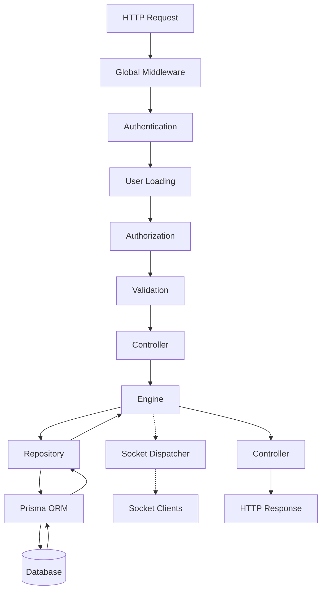

# Mathematics Club Event Backend

## 1. Project Overview

**Purpose:** This backend serves as the core infrastructure for an IPO/Auction event managed by the Mathematics Club. It facilitates real-time package bidding, portfolio tracking, and event lifecycle management.

**Scope:** The system manages the lifecycle of an auction event, including starting and pausing the event, activating packages for auction, processing transactions, tracking team portfolios (cash and share holdings), broadcasting real-time updates to participants, and generating dashboards for both participants and organizers.

**Responsibilities:**
- Enforcing business rules and state machine transitions for the event and packages.
- Processing database transactions to prevent race conditions during package activation and sales.
- Providing role-based access control (RBAC) via Clerk authentication.
- Aggregating participant portfolios dynamically.
- Broadcasting real-time state changes via Socket.IO.

---

## 2. Technology Stack

| Category | Technology |
| :--- | :--- |
| **Runtime** | Node.js (>=20), `tsx` |
| **Framework** | Express 5 |
| **Database** | PostgreSQL |
| **ORM** | Prisma Client (v6.x) |
| **Authentication**| Clerk (`@clerk/express`) |
| **Logging** | Pino (`pino`, `pino-http`) |
| **Realtime** | Socket.IO |

---

## 3. Design Principles

The backend architecture follows several structural and architectural conventions:

- **Controllers primarily orchestrate HTTP interactions:** Controllers are responsible for extracting parameters, calling the Engine layer, and returning the structured response. They avoid implementing domain logic.
- **Engines contain business logic:** All state machine validations, rule enforcement, and orchestration occur in the Engine layer.
- **Repositories encapsulate database access:** Engines delegate data fetching and mutation to Repositories. Prisma calls are restricted to the Repository layer.
- **Business validation occurs before persistence where possible:** Rules (e.g., sufficient funds, bid minimums) are checked in memory by the Engine before the Repository is instructed to persist changes.
- **Database transactions are used when atomicity is required:** Complex state changes (like activating a package or recording a sale) utilize Prisma transactions to guarantee atomicity and prevent race conditions.
- **Socket events are emitted only after successful state changes:** The Engine triggers Socket.IO broadcasts strictly after the Repository successfully commits the changes.
- **AppError represents expected business failures:** Domain errors (e.g., invalid state transitions, insufficient funds) throw an `AppError` which the global error handler intercepts and maps to a 4xx HTTP response.
- **Unexpected exceptions are handled by the global error middleware:** Any non-`AppError` exception bubbles up to the error handler, is logged via Pino, and returns a 500 Internal Server Error.
- **Modules remain vertically organized by feature:** Code is grouped by domain entities (e.g., `event`, `package`, `transaction`) rather than technical concern.

---

## 4. High-Level Architecture

The system utilizes a vertical slice architecture based on domain modules, combined with a layered approach within each module.

### Layer Responsibilities
1. **Controller Layer:** Parses the incoming HTTP request (headers, params, body), invokes the necessary Engine methods, and structures the HTTP response.
2. **Engine Layer:** The domain core. It validates business rules, verifies state transitions, coordinates multiple repositories if needed, and dispatches real-time events.
3. **Repository Layer:** Abstracted data access. It encapsulates Prisma Client interactions, handles complex aggregations, and orchestrates database transactions.

### Dependency Direction
Requests flow strictly downward: **Router → Controller → Engine → Repository → Database**.
Layers depend on abstractions or data interfaces passed downwards. Engines do not call Controllers. Repositories do not call Engines.

### Separation of Concerns
Controllers, Engines, and Repositories are separated to ensure that HTTP concerns (parsing, status codes) do not pollute business logic (rule evaluation), and business logic does not pollute data access (SQL/Prisma queries). This makes testing and maintaining each layer significantly easier.

### Error Propagation
Errors generated at the Repository or Engine layers (usually `AppError`) are thrown upwards. The Controller catches these in a `try/catch` block and forwards them to `next(err)`. The global Express `errorHandler` middleware catches them at the end of the request lifecycle.

### Socket.IO Integration
The HTTP server and Socket.IO server share the same Node.js process. When the Engine layer successfully mutates state via the Repository, it immediately calls the `dispatcher` (a part of the Socket.IO infrastructure) to emit an event. This ensures clients receive real-time updates instantly after an HTTP request modifies the server state.

---

## 5. Request Flow

The lifecycle of an incoming HTTP request flows sequentially through the application stack:



### Stage Responsibilities
1. **Global Middleware:** Applies security headers (`helmet`), enables cross-origin requests (`cors`), compresses payloads (`compression`), and parses JSON bodies (`express.json`).
2. **Authentication:** Clerk middleware verifies the JWT signature and expiration.
3. **User Loading:** The `loadUser` middleware queries the database for the user matching the Clerk ID and attaches the domain user object to the request.
4. **Authorization:** The `authorize` middleware verifies if the loaded user possesses a role permitted to access the route.
5. **Validation:** The `validate` middleware parses the request body against a Zod schema, ensuring structural correctness before domain processing.
6. **Controller:** Extracts parameters and invokes the Engine.
7. **Engine:** Executes business logic and validates rules.
8. **Repository:** Executes Prisma queries or transactions.
9. **Prisma:** Translates JavaScript calls to SQL queries.
10. **Database:** Executes the SQL and returns rows.
11. **Socket Dispatcher:** Broadcasts a notification to all connected clients if a state change occurred.
12. **Controller Response:** Formats the successful response.

---

## 6. Folder Structure

- **`src/config/`**: Houses environment configuration and logging setup.
- **`src/errors/`**: Defines the custom `AppError` class for domain exceptions.
- **`src/lib/`**: Contains global library singletons, specifically the initialized Prisma Client.
- **`src/middleware/`**: Contains global and route-specific middleware (`auth`, `authorize`, `loadUser`, `errorHandler`, `validate`).
- **`src/modules/`**: Contains all feature modules.
- **`src/routes/`**: Aggregates all module routers into a unified application router.
- **`src/socket/`**: Contains Socket.IO initialization, connection handlers, room definitions, event constants, and the dispatcher.
- **`src/types/`**: Contains custom TypeScript definitions to extend Express objects.
- **`src/utils/`**: Houses general utility functions.

### Module Breakdown (`src/modules/`)

| Module | Purpose | Responsibilities | Interaction with other modules |
| :--- | :--- | :--- | :--- |
| **`announcement`** | Global broadcasts. | Creating and retrieving system-wide messages. | Interacts with Socket Dispatcher to broadcast. |
| **`auth`** | Identity verification. | Providing the current authenticated user's details. | None natively. |
| **`dashboard`** | Organizer overview. | Aggregating event status, package lists by state, and team balances into a single live view. | None natively. |
| **`event`** | Event lifecycle. | Handling state transitions (start, pause, complete) and fetching the current status. | Repositories are imported by `package` and `transaction` engines to check event state. |
| **`package`** | Package lifecycle. | Listing packages, activating them for auction, and marking them unsold. | Calls Event repository to enforce running rules. |
| **`participant`** | Team views. | Aggregating deep portfolio statistics (holdings by sector/company, capture rate) for participants. | None natively. |
| **`team`** | Team administration. | Fetching detailed purchase histories and members for a specific team. | None natively. |
| **`transaction`** | Sale processing. | Executing package purchases, transferring ownership, and deducting team funds. | Calls Event and Package repositories for state validation. |

---

## 7. Configuration

Environment variables are rigorously validated on startup using Zod in `src/config/env.ts`.

| Variable | Purpose | Missing Behavior |
| :--- | :--- | :--- |
| `NODE_ENV` | Sets the runtime environment (`development`, `production`, `test`). | Defaults to `development`. |
| `PORT` | Defines the HTTP server listening port. | Server fails to start (Zod validation throws). |
| `DATABASE_URL` | Prisma connection string for the PostgreSQL database. | Server fails to start (Zod validation throws). |
| `DIRECT_URL` | Direct connection string for Prisma migrations. | Server fails to start (Zod validation throws). |
| `CLERK_SECRET_KEY` | Secret key for Clerk authentication middleware to verify JWTs. | Server fails to start (Zod validation throws). |

---

## 8. Database Model

### **`Event` (`events`)**
- **Purpose:** Represents the singleton event state and tracks the currently auctioned package.
- **Important fields:** `status` (lifecycle state), `activePackageId` (the package currently up for bid).
- **Constraints:** `activePackageId` is unique, enforcing that only one package can be active at any given time.
- **Business meaning:** The anchor for the entire auction. Most operations (sales, activations) rely on the Event being running.

### **`Team` (`teams`)**
- **Purpose:** Represents a participating syndicate bidding on packages.
- **Important fields:** `remainingCash` (the current available bidding cash).
- **Relationships:** Has many `Users`, `Packages` (owned), and `Transactions`.
- **Business meaning:** Teams are the primary financial entities. Their `remainingCash` dictates purchasing power.

### **`User` (`users`)**
- **Purpose:** Represents a participant or organizer in the system.
- **Important fields:** `clerkId` (identity provider linkage), `role` (authorization tier), `teamId` (team affiliation).
- **Relationships:** Belongs to a `Team`, authors `Announcements`, organizes `Transactions`.
- **Business meaning:** Defines who is performing actions and what actions they are permitted to perform.

### **`Company` (`companies`)**
- **Purpose:** Represents an underlying equity entity bundled into packages.
- **Important fields:** `sector`, `initialPrice`.
- **Relationships:** Many-to-many with `Package` via `PackageCompany`.
- **Business meaning:** The fundamental asset teams are attempting to acquire to build sector-diverse portfolios.

### **`Package` (`packages`)**
- **Purpose:** Represents a bundle of company shares auctioned as a single unit.
- **Important fields:** `basePrice` (minimum bid), `status` (lifecycle), `winningBid` (final sale price).
- **Relationships:** Belongs to an `ownerTeam` upon sale, associated with multiple `Companies`.
- **Constraints:** `name` is unique.
- **Business meaning:** The core unit of trade in the event.

### **`PackageCompany` (`package_companies`)**
- **Purpose:** Join table resolving the many-to-many relationship between Packages and Companies.
- **Important fields:** `shares` (quantity of the company in the package).
- **Relationships:** Links `Package` and `Company`.
- **Constraints:** Composite primary key on `packageId` and `companyId`.

### **`Transaction` (`transactions`)**
- **Purpose:** Immutable ledger of completed sales.
- **Important fields:** `winningBid` (the price paid).
- **Relationships:** Links a `Team` (buyer), `Package` (asset), and `User` (organizer who executed it).
- **Constraints:** `packageId` is unique, enforcing exactly one transaction per package.
- **Business meaning:** The financial record defining ownership transfer and cash deduction.

### **`Announcement` (`announcements`)**
- **Purpose:** System-wide broadcast messages.
- **Important fields:** `message`, `createdAt`.
- **Relationships:** Belongs to the `User` (author).

---

## 9. Entity Relationships

- **Ownership:** Teams gain ownership of a `Package` when a `Transaction` is created. A Package is permanently bound to a Team via the `ownerTeamId` foreign key.
- **Cardinality:**
  - `Event` (1) ↔ `Package` (0..1) as the active package.
  - `Package` (1) ↔ `PackageCompany` (M) ↔ `Company` (1).
  - `Team` (1) ↔ `Transaction` (M).
  - `Package` (1) ↔ `Transaction` (0..1).
- **Lifecycle Interaction:** During an IPO event, the `Event` holds an `activePackageId`. Upon a successful `Transaction`, the `Package` receives an `ownerTeamId`, its status shifts to `SOLD`, the `Team`'s cash decreases, and the `Event` releases the `activePackageId` back to `null`, preparing for the next activation.

---

## 10. State Machines

### Event Lifecycle (`EventStatus`)
Enforced primarily by the `eventEngine`.

| Current State | Next Valid State | Trigger | Engine Method |
| :--- | :--- | :--- | :--- |
| `WAITING` | `IPO_RUNNING` | Manual start. | `eventEngine.startEvent()` |
| `IPO_RUNNING` | `IPO_PAUSED` | Manual pause. | `eventEngine.pauseEvent()` |
| `IPO_PAUSED` | `IPO_RUNNING` | Manual resume. | `eventEngine.resumeEvent()` |
| `IPO_RUNNING` | `IPO_COMPLETED` | Manual complete. | `eventEngine.completeEvent()` |

### Package Lifecycle (`PackageStatus`)
Enforced primarily by the `packageEngine` and `transactionEngine`.

| Current State | Next Valid State | Trigger | Engine Method |
| :--- | :--- | :--- | :--- |
| `NOT_REVEALED`| `ACTIVE` | Manual activation. | `packageEngine.activatePackage()` |
| `ACTIVE` | `SOLD` | Recording a transaction. | `transactionEngine.recordSale()` |
| `ACTIVE` | `UNSOLD` | Manual discard. | `packageEngine.markUnsold()` |

---

## 11. Business Rules

### Event Rules
- **Running Requirement:** An Event must be `IPO_RUNNING` to activate a package, record a sale, or mark a package unsold.
- **Completion Block:** An Event cannot transition to `IPO_COMPLETED` if there is a non-null `activePackageId`.
- **Single Active Package:** Only one package can be active at a time. Activating a package sets the Event's `activePackageId`.

### Package Rules
- **Activation Status:** A package must currently be `NOT_REVEALED` in order to be activated.
- **Transaction Status:** A package must currently be `ACTIVE` in order to be sold or marked `UNSOLD`.
- **Active Match:** A package can only be sold if its ID matches the Event's `activePackageId`.

### Transaction Rules
- **Unowned Requirement:** A package must not currently have an `ownerTeamId` before a transaction can be recorded.
- **Bid Minimum:** The `winningBid` must be greater than or equal to the package's `basePrice`.
- **Single Transaction:** Only one transaction can exist per package.

### Participant Rules
- **Sufficient Funds:** A purchasing Team must have `remainingCash` greater than or equal to the `winningBid`.
- **Starting Cash Inference:** A team's starting cash is generally derived dynamically via `remainingCash + totalInvestment`, where total investment is the sum of all winning bids in their transaction history.

### Statistics Rules
- **Capture Rate:** Derived as `(packagesWon / packagesAuctioned) * 100`, where `packagesAuctioned` equals all packages in `SOLD` or `UNSOLD` status.
- **Investment Utilized:** Derived as `(totalInvestment / startingCash) * 100`.

### Authentication Rules
- **Identity:** All protected endpoints require a valid Clerk JWT.
- **Registration:** Users must possess a corresponding `User` record in the database mapped via `clerkId`.
- **Role Enforcement:** Users are restricted to endpoints matching their database-defined `UserRole`.

---

## 12. Module Documentation

### `auth`
- **Purpose:** Identity verification.
- **Responsibilities:** Supplying the client with the currently loaded application user.
- **Routes:** `GET /me`
- **Controllers:** `getCurrentUser`
- **Engines:** N/A (Handled via middleware)
- **Business rules enforced:** Validates presence of user in database.

### `announcement`
- **Purpose:** System broadcasts.
- **Responsibilities:** Managing global notifications.
- **Routes:** `GET /`, `POST /`
- **Engines:** `announcementEngine` creates records and dispatches Socket events.
- **Validation:** `message` string (max 500 chars).
- **Socket interactions:** Dispatches `ANNOUNCEMENT_CREATED`.

### `dashboard`
- **Purpose:** Organizer overview.
- **Responsibilities:** Generating a live, aggregated snapshot of the entire event state.
- **Routes:** `GET /live`
- **Engines:** `dashboardEngine`
- **Repositories:** Executes parallel queries to gather event status, categorized packages, and team cash.

### `event`
- **Purpose:** Event lifecycle management.
- **Responsibilities:** Validating and executing event state transitions.
- **Routes:** `GET /`, `POST /start`, `POST /pause`, `POST /resume`, `POST /complete`
- **Engines:** `eventEngine` validates valid transitions and checks the active package constraint on completion.
- **Socket interactions:** Dispatches `EVENT_STARTED`, `EVENT_PAUSED`, `EVENT_RESUMED`, `EVENT_ENDED`.
- **Business rules enforced:** Valid transition matrix, no active package on completion.

### `package`
- **Purpose:** Package lifecycle control.
- **Responsibilities:** Revealing packages for auction and discarding unsold ones.
- **Routes:** `GET /`, `GET /active`, `GET /:id`, `POST /:id/activate`, `POST /:id/unsold`
- **Engines:** `packageEngine` validates the event is running and the package is in the correct initial state.
- **Repositories:** Employs a complex Prisma interactive transaction (`activatePackage`) using CAS constraints.
- **Socket interactions:** Dispatches `PACKAGE_ACTIVATED`, `PACKAGE_UNSOLD`.
- **Business rules enforced:** Event running requirement, correct package state, singleton active package.

### `participant`
- **Purpose:** Participant interfaces.
- **Responsibilities:** Generating deep portfolio statistics and cash breakdowns for teams.
- **Routes:** `GET /team-console`, `GET /dashboard`
- **Engines:** `participantEngine` aggregates company shares by sector and calculates mathematical statistics (Capture Rate, Total Investment, Average Bid).
- **Repositories:** Utilizes deep nested includes (`Team → Packages → PackageCompanies → Company`).

### `team`
- **Purpose:** Team administration.
- **Responsibilities:** Fetching historical purchases and members for specific teams.
- **Routes:** `GET /:id`
- **Engines:** `teamEngine`

### `transaction`
- **Purpose:** Sale processing.
- **Responsibilities:** Recording purchases, transferring ownership, and deducting funds.
- **Routes:** `POST /`
- **Engines:** `transactionEngine` orchestrates the most complex validations in the system.
- **Repositories:** Uses a grouped `$transaction` to update 4 tables atomically.
- **DTOs & Validation:** `TransactionInput` (`packageId`, `teamId`, `winningBid` as positive integer).
- **Socket interactions:** Dispatches `PACKAGE_SOLD`.
- **Business rules enforced:** Event running, Package active, Active match, Package unowned, Bid minimum, Sufficient funds.

---

## 13. API Reference

### Health
- **Method / Route:** `GET /health`
- **Purpose:** System liveness check.
- **Auth / Roles:** Unauthenticated.
- **Response:** `{ status: "ok" }`

### Auth
- **Method / Route:** `GET /auth/me`
- **Purpose:** Fetch current user context.
- **Auth / Roles:** Required / `ALL`
- **Response:** `{ user: User }`

### Event
- **Method / Route:** `GET /event/`
- **Purpose:** Fetch current event state.
- **Auth / Roles:** Required / `ALL`
- **Response:** `{ status: EventStatus, activePackageId: string | null }`

- **Method / Route:** `POST /event/start`
- **Purpose:** Transition event to running.
- **Auth / Roles:** Required / `ORGANIZERS`
- **Response:** `{ message: "Event started." }`
- **Possible AppErrors:** 409 Conflict (invalid transition).

- **Method / Route:** `POST /event/pause`
- **Purpose:** Transition event to paused.
- **Auth / Roles:** Required / `ORGANIZERS`
- **Response:** `{ message: "Event paused." }`

- **Method / Route:** `POST /event/resume`
- **Purpose:** Transition event from paused to running.
- **Auth / Roles:** Required / `ORGANIZERS`
- **Response:** `{ message: "Event resumed." }`

- **Method / Route:** `POST /event/complete`
- **Purpose:** Finalize the event.
- **Auth / Roles:** Required / `ORGANIZERS`
- **Response:** `{ message: "Event completed." }`
- **Possible AppErrors:** 409 Conflict (active package exists).

### Packages
- **Method / Route:** `GET /packages/`
- **Purpose:** List all packages.
- **Auth / Roles:** Required / `ALL`
- **Response:** `Package[]`

- **Method / Route:** `GET /packages/active`
- **Purpose:** Fetch the currently active package.
- **Auth / Roles:** Required / `ALL`
- **Response:** `Package`
- **Possible AppErrors:** 404 Not Found (no active package).

- **Method / Route:** `GET /packages/:id`
- **Purpose:** Fetch a specific package with its full company composition.
- **Auth / Roles:** Required / `ALL`
- **Response:** `PackageDetail` — all scalar `Package` fields plus a `companies` array. Each element of `companies` is a `PackageCompanyDetail` object:
  - `id` (string): Company ID.
  - `name` (string): Company name.
  - `sector` (string): Industry sector.
  - `description` (string): Company description.
  - `logo` (string | null): URL of the company logo, or null if not set.
  - `initialPrice` (number): The company's initial share price.
  - `shares` (number): Number of shares of this company included in the package (sourced from the `PackageCompany` join table).
- **Possible AppErrors:** 404 Not Found (package does not exist).

- **Method / Route:** `POST /packages/:id/activate`
- **Purpose:** Set a package as active on the event.
- **Auth / Roles:** Required / `ORGANIZERS`
- **Response:** `{ message: "Package activated." }`
- **Possible AppErrors:** 409 Conflict (event not running, package already active, event already has active package).

- **Method / Route:** `POST /packages/:id/unsold`
- **Purpose:** Discard an active package.
- **Auth / Roles:** Required / `ORGANIZERS`
- **Response:** `{ message: "Package marked as unsold." }`
- **Possible AppErrors:** 409 Conflict (event not running, package not active).

### Transactions
- **Method / Route:** `POST /transactions/`
- **Purpose:** Record a package sale.
- **Auth / Roles:** Required / `ORGANIZERS`
- **Request Body:** `{ packageId: string, teamId: string, winningBid: number }`
- **Response:** `{ message: "Transaction recorded successfully." }`
- **Possible AppErrors:** 409 Conflict (event not running, package not active, bid too low, insufficient funds, etc.).

### Announcements
- **Method / Route:** `GET /announcements/`
- **Purpose:** Fetch all announcements.
- **Auth / Roles:** Required / `ALL`
- **Response:** `AnnouncementWithAuthor[]`

- **Method / Route:** `POST /announcements/`
- **Purpose:** Create an announcement.
- **Auth / Roles:** Required / `ORGANIZERS`
- **Request Body:** `{ message: string }`
- **Response:** `{ message: "Announcement created." }`

### Dashboards & Participants
- **Method / Route:** `GET /dashboard/live`
- **Purpose:** Organizer dashboard aggregator.
- **Auth / Roles:** Required / `ORGANIZERS`
- **Response:** `LiveDashboard`

- **Method / Route:** `GET /teams/:id`
- **Purpose:** Detailed team administration view.
- **Auth / Roles:** Required / `ORGANIZERS`
- **Response:** `TeamDetail`

- **Method / Route:** `GET /participant/team-console`
- **Purpose:** Deep participant portfolio aggregator.
- **Auth / Roles:** Required / `PARTICIPANT`
- **Response:** `TeamConsoleResult`
- **Possible AppErrors:** 403 Forbidden (User lacks a teamId).

- **Method / Route:** `GET /participant/dashboard`
- **Purpose:** Light participant dashboard aggregator.
- **Auth / Roles:** Required / `PARTICIPANT`
- **Response:** `DashboardResult`
- **Possible AppErrors:** 403 Forbidden (User lacks a teamId).

*(Note: `ALL` means `PRIMARY_ORGANIZER`, `SECONDARY_ORGANIZER`, and `PARTICIPANT`. `ORGANIZERS` includes `PRIMARY` and `SECONDARY` only).*

---

## 14. Error Handling

- **`AppError`:** The canonical custom error class. It inherits from `Error` and attaches a public `statusCode`. This is thrown explicitly by Engine and Repository layers when business constraints fail (e.g., 409 Conflict) or resources are missing (404 Not Found).
- **Global Error Middleware:** Located at the end of the Express router. It intercepts all unhandled errors passed to `next(err)`.
- **Error Propagation:**
  - If the error is an instance of `AppError`, the middleware maps it directly to a JSON response `{ message }` with the defined `statusCode`.
  - If the error is an unhandled exception (e.g., a database connection failure or a null pointer), it logs the error and maps it to a generic 500 Internal Server Error.
- **Logging:** Unhandled exceptions are logged via Pino (`logger.error(err)`) to ensure trace visibility without leaking stack traces to the client.

---

## 15. Transactions & Concurrency

The system utilizes Prisma database transactions extensively to enforce data integrity during concurrent requests.

### `activatePackage`
- **Why it exists:** To prevent two organizers from activating packages simultaneously, or activating a package while one is already active.
- **Operations Grouped:** Updating the `Package` status to `ACTIVE` and the `Event` `activePackageId` to the target package.
- **Race conditions prevented:** Two concurrent requests could both see `Event.activePackageId === null` and attempt an update.
- **CAS Usage:** Employs a Prisma interactive transaction (`$transaction(async (tx))`). The updates act as Compare-And-Swap operations by including the expected state in the `where` clause (`where: { id, activePackageId: null }`). If the update count returns 0, the transaction aborts with a 409 AppError.

### `deactivatePackage`
- **Why it exists:** To discard a package cleanly.
- **Operations Grouped:** Updating `Package` status to `UNSOLD` and resetting `Event.activePackageId` to `null`.
- **Atomicity requirement:** If the package is marked unsold but the event is not cleared, the auction is permanently halted.

### `recordSale`
- **Why it exists:** To execute the primary financial exchange of the application.
- **Operations Grouped:** Creating the `Transaction`, decrementing `Team.remainingCash`, updating `Package` ownership and status to `SOLD`, and clearing `Event.activePackageId`.
- **Atomicity requirement:** Ensures money is not deducted without transferring ownership, and ensures the event is cleared precisely when the asset is sold.

---

## 16. Socket.IO

- **Initialization:** Socket.IO is initialized alongside the Express HTTP server in `src/socket/socket.ts`, sharing the same Node.js process and HTTP port.
- **Connection Lifecycle:** Clients connect and are automatically forced to join a singular, shared room named `event`.
- **Rooms:** The application currently employs a single global `event` room.
- **Dispatcher:** The `dispatcher.ts` file abstracts the Socket.IO instance. It exports typed functions (e.g., `packageSold()`) that Engines call to emit strictly typed events.
- **Events:** `EVENT_STARTED`, `PACKAGE_ACTIVATED`, `PACKAGE_SOLD`, `PACKAGE_UNSOLD`, `ANNOUNCEMENT_CREATED`, `EVENT_ENDED`, `EVENT_PAUSED`, `EVENT_RESUMED`.
- **Broadcast Lifecycle:** An HTTP request hits a Controller → Engine executes logic → Engine calls Repository → DB is updated → Engine calls Dispatcher → Dispatcher emits to Socket.IO room → Clients receive realtime UI update.

---

## 17. Authentication & Security

- **Authentication:** Enforced by Clerk. The backend trusts the signed JWT provided by Clerk and validates its integrity via `@clerk/express`.
- **Authorization:** Handled internally via the `UserRole` enum stored in the database. `loadUser` binds the database record to the session, and `authorize` enforces RBAC boundaries.
- **Validation:** All POST bodies are strictly parsed using `zod` in `src/middleware/validate.ts`. Extraneous data is stripped, and malformed data yields an immediate 400 Bad Request.
- **Helmet:** Used globally to inject standard HTTP security headers (e.g., XSS Protection, No-Sniff).
- **CORS:** Configured globally for Express and Socket.IO. Currently permissive (`origin: "*"`).
- **Trust Boundaries:** The database is considered the source of truth for authorization, regardless of claims in the Clerk JWT. User identities are verified at the boundary; internal Engine calls assume valid data structures (validated by Zod).

---

## 18. Deployment Notes

The complete deployment and initialization flow:

1. **Install dependencies:**
   ```bash
   npm install
   ```
2. **Configure environment:** Set all required variables in `.env` (Database URLs, Clerk Keys, Port).
3. **Run migrations:** Ensure the database schema is up-to-date.
   ```bash
   npm run prisma:migrate
   ```
4. **Generate Prisma Client:** Rebuild the typings.
   ```bash
   npm run prisma:generate
   ```
5. **Build:** Compile TypeScript source code to JavaScript.
   ```bash
   npm run build
   ```
6. **Start:** Launch the production build.
   ```bash
   npm start
   ```
7. **Verify:** Check the `/health` endpoint to confirm the server and database are responsive.

---

## 19. Known Assumptions

### System Assumptions
- **Singleton Event:** The system structurally assumes exactly one `Event` row exists in the database. `prisma.event.findFirst()` is used globally without ID filtering.
- **Identity Mapping:** Authentication relies on Clerk providing a `userId`, which is mapped exactly to the `clerkId` on the internal `User` model.

### Business Assumptions
- **Dynamic Initial Balance:** The system assumes a team's starting balance is not explicitly recorded but can be dynamically reconstructed by summing `remainingCash` and the `winningBid` of all their transactions.

### Operational Assumptions
- **Pre-created Data:** It is assumed that the Event, Packages, Companies, Teams, and Users are seeded or created externally. The current implementation contains no endpoints for creating these entities natively.
